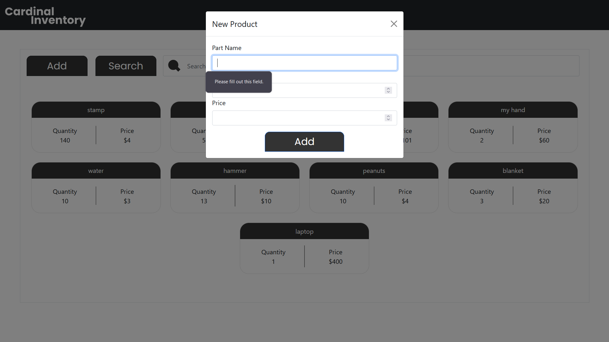

# Cardinal Inventory

## Welcome to Cardinal Inventory

>This is the final project for CS50. This is a small easy to use inventory management system that can be ran in the browser.

## Introduction
Click [here](https://www.youtube.com/watch?v=Hg77ib8W1MM) for a video walkthrough of the program:

### Background
There is no need to sign up for an account. I did this in the first iteration of the project but found it unnecessary and wanted to put my effort into making a SPA (Single Page Application) instead.

### Files and their Purpose
This project is made up of 3 primary files:

>app.py

>validation.py

>script.js

#### **app.py**
This is where all the logic for adding and updating the database lives. Everytime one of the buttons posts to the *add* or *update* url it calls part of the function. It doesn't have to worry about if it is updating the proper entry as that information is locked in when the user clicks the product they want to edit.

#### **validation.py**
This house the main logic and checks for the *Add* modal form. I wanted to seperate this out to get a clear understanding about seperating helper functions and how to import them into my own code.

#### **script.js**
This handles all the heavy lifting for the dynamic assignment of all the input fields when editing a product as well as the search field. For a little bit I was trying to see if I could get JavaScript to execute python code on click, but learned that there is some securities in place to stop this from happening and decided to do it this way instead. Really had to learn about the DOM for this section and how it related to children.

# User Instructions

## Using the Program

### Adding A Product
First thing that can be done when loading **Cardinal Inventory** is adding a product to your Database

*While hovering over the button they change there color to show you that they can be used*

When you click the add button you will be greated with a Modal window:

If you leave any of these fields blank or try to input a value not appropriate for the field it will return a tooltip telling you something has to be fixed before submitting the form.

### Editing A Product

With editing a product all you have to do is click the black title with the product you want to edit 

*You with be shown what you can click when hovering just like the add button*

After you click a new modal will appear with all information filled in based on what product you wanted to edit.

*The part name is not editable as if this is changed it won't know what to pull from the database*

After you are done making changes to either the **Quantity** or the **Price** you can press the large **UPDATE** button and that will update the part and close the modal.

### Deleting a Product

To Delete a product all you need to do is click on the part you want to Delete and press the large **DELETE** button.

# **Warning - You are not prompted if you actually want to delete this Product so be careful**

# Prerequisite
### Installations

By following these instructions you can run this application on your local machine

Use `pip install -r requirements.txt` to install requirements

Run `flask run` in the console to start the app

# Notes

This was a fun project to work on and get running inside of a single page. If I were to add on to this I would add the following:
>Login Page 

>Transaction Logs for Each Product

>Billing page

>Customer Page

My hope is that when I have more projects and skills under my belt I can come back and redo this with better practices and flush out some of these features.
